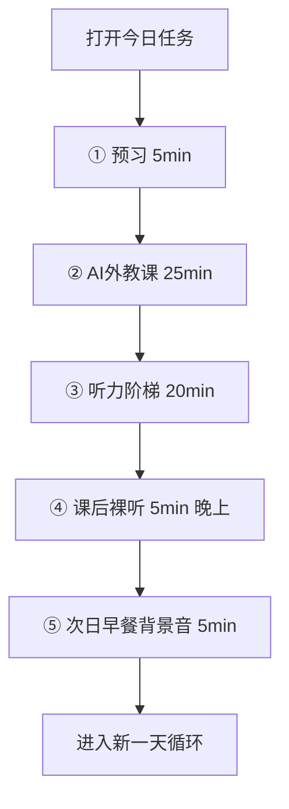

# 儿童英语每日学习系统 — 产品需求文档（PRD）

> 版本：v1.0  
> 日期：2026-08-01  
> 目标设备：华为平板（儿童端）+ 手机/电脑（家长端）  
> 状态：可直接进入技术方案与 MVP 开发

---

## 1. 产品定位

### 1.1 一句话

面向家庭自用的**英语每日学习教练系统**：家长后台排课与上传资料，孩子在华为平板上按固定流程完成「预习 → AI 外教课 → 复习 → 听力阶梯 → 次日早餐巩固」。

### 1.2 核心原则

| 原则 | 说明 |
|------|------|
| 闭环优先 | 不是自由聊天 App，而是严格按任务清单推进 |
| 家长可控 | 所有音视频/文本由家长上传，每日任务由家长制定 |
| 短时高效 | 单日总时长约 55 分钟，节奏固定、步骤不可跳过（可配置） |
| 平板友好 | 大字号、大按钮、单手可操作、离线可播已缓存音频 |

### 1.3 不做的事（明确边界）

- 不做开放式 Free Talk 主流程（拓展问答仅限当日对话主题）
- 不做社交、社区、排行榜
- 不做海量公开课程商城（资料全部家长自建）
- 首期不做多孩子复杂权限（可预留多档案）

---

## 2. 用户角色

| 角色 | 端 | 主要目标 |
|------|----|----------|
| 孩子（学习者） | 华为 Pad | 按今日任务一步步学完，有进度反馈 |
| 家长（管理者） | Web 管理后台 | 上传资料、排每日任务、看完成情况与薄弱点 |

---

## 3. 推荐产品形态（华为 Pad 怎么做）

### 3.1 建议架构（最易落地）

```
┌─────────────────────┐     ┌──────────────────────────┐
│  家长 Web 后台       │     │  孩子平板端（PWA/App）    │
│  资料库 / 排课 / 报告 │────▶│  今日任务 / AI 外教 / 播放 │
└─────────────────────┘     └──────────────────────────┘
              │                        │
              └────────┬───────────────┘
                       ▼
              ┌─────────────────┐
              │  云端 API + AI   │
              │  ASR / TTS / LLM │
              └─────────────────┘
```

**推荐组合（家庭自用、开发成本最低）：**

| 层级 | 技术建议 | 原因 |
|------|----------|------|
| 孩子端 | **平板优先 Web App（PWA）**，可再包一层鸿蒙/安卓壳 | 华为 Pad 浏览器可用；音视频、录音成熟；迭代快 |
| 家长端 | 同一套 Web，角色登录区分 | 一套代码两端用 |
| 后端 | Node.js / Python（FastAPI）+ 对象存储 | 上传音视频文本简单 |
| AI | 语音识别（ASR）+ 语音合成（TTS）+ 大模型（对话纠正/问答） | 支撑外教三步法 |
| 本地能力 | 今日任务音频**预下载缓存** | 通勤/弱网/早餐背景音可播 |

> 若后续要上架华为应用市场：用 **ArkTS 原生壳 + WebView**，或用 **Flutter / Uni-app** 出鸿蒙/安卓包。MVP 先做 Web 完全够用。

### 3.2 产品该做成什么样

做成 **「每日学习教练」**，不是词典、不是网课平台。

孩子打开 App 只看到一页：

**「今天要做的事」**（按顺序锁定）

1. 预习（5 分钟）  
2. AI 外教课（25 分钟）  
3. 听力阶梯（20 分钟）  
4. 课后裸听（5 分钟，晚上解锁）  
5. 次日早餐巩固（5 分钟，次日早上任务）

每一步完成打勾，全部完成后显示「今日达标」+ 简单鼓励动画。

---

## 4. 每日学习流程（业务主流程）

总时长约 **55 分钟/天**（不含次日早餐 5 分钟）。



### 4.1 第一步：预习 → 上课 → 复习闭环

#### ① 课前预习（5 分钟）— 必须完成才能进 AI 课

**资料来源（家长指定其一）：**

- 《Easy English Conversations》对话文本  
- 《小猪佩奇》对话文本  

**孩子端能力：**

| 功能 | 说明 |
|------|------|
| 展示对话文本 | 分段高亮，当前句放大 |
| 生词自动标记 | 基于词表/词典 API，点击显示中文释义 |
| AI 智能带读 | TTS 逐句/跟读模式；孩子点「跟读」后录音比对 |
| 读熟判定 | 至少完整跟读 1 遍，或家长设定「需跟读 N 句」 |
| 预习完成 | 满足条件后解锁「去上课」 |

**验收标准：**

- 生词有标记、点开有翻译  
- 可 AI 带读  
- 未完成预习不能进入 AI 外教（可家长后台关闭强制）

#### ② 课中 AI 外教（25 分钟）— 固定三件事，禁止 Free Talk

顺序固定，不可打乱：

| 阶段 | 时长建议 | AI 行为 | 孩子行为 | 系统能力 |
|------|----------|---------|----------|----------|
| A. 朗读纠音 | ~10 min | 听孩子读预习对话，纠正发音与连读 | 逐句/整段朗读 | ASR + 发音评分 + 纠错语音反馈 |
| B. 范读复述 | ~10 min | 正常语速朗读全文；请孩子用中/英复述大意 | 复述关键词/大意 | TTS 正常语速；录音；LLM 评判「是否抓住大意」 |
| C. 问答拓展 | ~5 min | 围绕对话主题提问（如买水果 → favorite fruit） | 口头回答 | LLM 生成 3–5 个相关问题；口语对话回合 |

**约束：**

- 问题必须绑定当日对话主题（由系统根据文本自动生成 + 家长可预审）  
- 不做无关闲聊入口  
- 每阶段结束后显示「本阶段完成」，进入下一阶段  

**验收标准：**

- 三阶段 UI 进度条清晰  
- 有发音纠错反馈（文字 + 语音）  
- 复述有「通过/再试一次」  
- 问答至少完成设定题数（默认 3 题）

#### ③ 课后复习（5 分钟）— 当天晚上必须做

| 功能 | 说明 |
|------|------|
| 时间窗 | 默认 18:00 后解锁（家长可配） |
| 裸听 3 遍 | 只播音频，默认隐藏文本；可紧急显示文本（计半完成或需家长确认） |
| 闭眼回忆引导 | 每遍之间 10–15 秒静默提示：「闭眼回忆外教口型与发音」 |
| 完成条件 | 完整播放满 3 遍（禁止拖到结尾刷进度；允许暂停，累计有效听时） |

### 4.2 第二步：每日听力阶梯（20 分钟/天）

按**学习周阶段**自动切换材料类型（家长可覆盖当日任务）。

| 阶段 | 周次 | 材料 | 操作流程 | 目标 |
|------|------|------|----------|------|
| L1 | 第 1–2 周 | 小猪佩奇（英音）+ Easy English Conversations | 选 1 集/1 对话 → 看文本跟读（标连读）→ 盲听 3 遍 | 啃真实语速 |
| L2 | 第 3–4 周 | Little Fox L4–L5（如罗宾汉） | 整集听 → 中文复述大意（不抠词） | 长段落耐力 |
| L3 | 第 5–6 周 | BBC Newsround 带字幕 | 先看字幕听 → 再关字幕听 | 新闻语速与词汇 |
| L4 | 第 7–8 周 | BBC Newsround 裸听 | 无字幕听 → 用 3 句话概括 | 最终目标 |

**孩子端对应能力：**

- 文本跟读模式（连读提示：可用下划线/波形标出）  
- 盲听模式（藏字幕）  
- 复述录音 + 家长/AI 简评  
- 「3 句话概括」输入或语音转写  
- 阶段进度仪表盘（当前在第几周、目标是什么）

### 4.3 第四步：次日早餐巩固（硬性规定）

| 功能 | 说明 |
|------|------|
| 任务生成 | 系统在 D 日完成后，自动生成 D+1「早餐背景音」任务 |
| 内容 | 前一天学的佩奇/对话音频 |
| 时长 | 约 5 分钟，完整播放 1 遍即可 |
| 场景 | 支持锁屏/熄屏播放、后台播放（平板常用） |
| 提醒 | 早晨推送：「边吃早饭边听昨天的对话」 |
| 统计意义 | 产品文案可提示：间隔复习提升留存（激励用，不做伪科学断言强制） |

---

## 5. 功能需求清单

### 5.1 孩子端（华为 Pad）

#### F1 今日任务首页

- 展示日期、连续打卡天数、今日总进度  
- 任务卡片按顺序排列，未解锁置灰  
- 一键「继续学习」进入当前未完成步骤  

#### F2 预习模块

- 对话文本展示、生词标注与释义  
- AI 带读 / 跟读录音  
- 预习完成校验  

#### F3 AI 外教课堂

- 三阶段向导（朗读纠音 → 范读复述 → 主题问答）  
- 实时/近实时语音反馈  
- 课堂报告：错音词、复述得分、问答摘要  

#### F4 听力阶梯

- 按周阶段切换模式 UI  
- 跟读 / 盲听 / 复述 / 概括 四种交互  
- 播放器：倍速（0.75/1.0）、复读句、AB 段循环  

#### F5 课后裸听 & 早餐巩固

- 强制遍数、静默回忆倒计时  
- 后台播放、定时结束  

#### F6 学习激励（轻量）

- 今日达标徽章、连续天数  
- 不做复杂游戏化，避免分心  

### 5.2 家长端（Web 后台）

#### P1 资料库

- 上传：音频、视频、文本（对话脚本）、字幕（SRT 可选）  
- 分类标签：佩奇 / Easy Conversations / Little Fox / Newsround / 自定义  
- 文本与音频绑定（一句一对齐，支持简单时间轴编辑）  
- 生词表：可手动维护或自动抽取后家长确认  

#### P2 每日任务编排

- 日历视图：为某一天指定  
  - 预习对话材料  
  - AI 课题材（默认同预习材料）  
  - 听力阶梯材料 + 所属阶段  
  - 是否开启强制顺序  
- 支持「按 8 周模板一键生成」再微调  
- 支持复制「昨天任务」  

#### P3 学习报告

- 每日完成情况（各模块是否完成、用时）  
- AI 课：高频错词、复述是否通过、问答文本回顾  
- 周报：听力阶段进度、缺卡提醒  
- 可导出简单周报图片/PDF（二期）  

#### P4 规则配置

- 各模块建议时长  
- 课后解锁时间  
- 是否强制预习  
- 孩子昵称、年级、语音偏好（英音优先）  

### 5.3 AI 能力需求

| 能力 | 用途 | MVP 要求 |
|------|------|----------|
| TTS | 带读、范读 | 英音；语速可调 |
| ASR | 跟读、复述、问答 | 儿童口音可用；返回文本 |
| 发音评估 | 纠音、连读提示 | 词级/句级得分 + 问题音素提示（可先做简化版：不准的词高亮） |
| LLM | 大意评判、主题问答、纠错话术 | 有系统提示词约束主题；输出适合儿童的短句反馈 |

---

## 6. 数据模型（落地用）

### 6.1 核心实体

```
Parent
ChildProfile
MediaAsset          # 音视频文件
Transcript          # 文本/字幕，含句级时间戳
VocabularyItem      # 生词：词、释义、所属材料
LearningMaterial    # 材料包（文本+音频+词汇+标签+阶段）
DailyPlan           # 某日任务编排
TaskItem            # 任务项：类型 + 材料 + 顺序 + 状态
LearningSession     # 一次学习记录：录音、得分、耗时
AIFeedback          # 纠音/复述/问答结果
Streak / CheckIn    # 打卡
```

### 6.2 任务类型枚举

```
PREVIEW          # 预习
AI_LESSON        # AI外教三阶段
LISTENING_LADDER # 听力阶梯
NIGHT_SHADOW     # 课后裸听
BREAKFAST_REVIEW # 次日早餐巩固
```

### 6.3 DailyPlan 示例（JSON）

```json
{
  "date": "2026-08-01",
  "phase_week": 1,
  "tasks": [
    {
      "type": "PREVIEW",
      "material_id": "conv_001",
      "duration_min": 5,
      "required": true
    },
    {
      "type": "AI_LESSON",
      "material_id": "conv_001",
      "duration_min": 25,
      "stages": ["read_aloud", "retell", "qa"]
    },
    {
      "type": "LISTENING_LADDER",
      "material_id": "peppa_012",
      "mode": "text_then_blind_x3",
      "duration_min": 20
    },
    {
      "type": "NIGHT_SHADOW",
      "material_id": "conv_001",
      "plays_required": 3,
      "unlock_after": "18:00"
    },
    {
      "type": "BREAKFAST_REVIEW",
      "material_id": "conv_001",
      "scheduled_for": "2026-08-02",
      "duration_min": 5
    }
  ]
}
```

---

## 7. 关键交互稿（文字版）

### 7.1 孩子端首页

```
┌──────────────────────────────────────┐
│  Hi, 豆豆        连续打卡 12 天        │
│  2026年8月1日 · 第1周 · 真实语速周     │
├──────────────────────────────────────┤
│  ✅ 1. 预习对话（5分钟）               │
│  ▶  2. AI外教课（进行中 12/25）        │
│  🔒 3. 听力阶梯                        │
│  🔒 4. 晚上裸听（18:00解锁）           │
│  🔒 5. 明天早餐巩固                    │
├──────────────────────────────────────┤
│           [ 继续学习 ]                 │
└──────────────────────────────────────┘
```

### 7.2 AI 外教三阶段

```
阶段 2/3 · 范读复述
外教正常语速朗读中...
[■■■■□□] 

听完后请用中文或英语说说大意：
[ 按住说话 ]     [ 键盘输入 ]

反馈：抓住了 buy / apples / how much ✓
再补一个细节试试？
```

---

## 8. MVP 范围（建议 4–6 周可做出能用版本）

### 8.1 MVP 必做

1. 家长：上传文本+音频、按日历排一天任务  
2. 孩子：今日任务列表 + 顺序解锁  
3. 预习：文本 + 生词点击翻译 + TTS 带读  
4. AI 课三阶段（纠音可先做「ASR 文本对比 + LLM 纠错话术」，发音评分可二期加深）  
5. 听力阶梯：跟读 + 盲听 3 遍（先打通第 1–2 周模式）  
6. 课后裸听 3 遍 + 次日早餐任务自动生成  
7. 完成状态同步给家长  

### 8.2 二期

- 精确发音评分、连读可视化  
- 第 3–8 周听力模式全部做完  
- 句级时间轴对齐编辑器  
- 推送通知（鸿蒙推送）  
- 离线包下载  
- 周报导出  

### 8.3 明确可砍

- 视频跟读口型对比（可用「闭眼回忆」文案替代，不必真做口型 CV）  
- 多孩子家庭账号  
- 内容版权商城  

---

## 9. 非功能需求

| 类别 | 要求 |
|------|------|
| 性能 | 打开今日任务 < 2s；音频起播 < 1s（已缓存） |
| 网络 | 弱网可播缓存；AI 功能需联网并友好提示 |
| 设备 | 华为 Pad 横屏/竖屏皆可用；优先竖屏单手流程 |
| 无障碍 | 字号可调；点击热区 ≥ 44px |
| 隐私 | 录音仅用于当次评估，可设置「仅本地家长可见」；API Key 仅服务端 |
| 版权 | 资料由家长自行合法上传；产品不内置盗版资源 |

---

## 10. 8 周内容运营模板（给家长后台预置）

系统预置「8 周阶梯模板」，家长导入后只需替换具体材料 ID：

| 周 | 预习+AI课材料池 | 听力阶梯模式 |
|----|-----------------|--------------|
| 1–2 | 佩奇 / Easy Conversations | 文本跟读 → 盲听×3 |
| 3–4 | 同上或简化对话 | Little Fox 整集听 + 中文复述 |
| 5–6 | 短对话巩固 | Newsround 字幕→关字幕 |
| 7–8 | 短对话巩固 | Newsround 裸听 + 3 句概括 |

每日固定附带：`NIGHT_SHADOW` + 次日 `BREAKFAST_REVIEW`。

---

## 11. 成功指标（家庭自用版）

| 指标 | 目标 |
|------|------|
| 日任务完整完成率 | ≥ 80% |
| 预习→AI课转化率 | ≥ 95%（强制解锁下） |
| 课后裸听完成率 | ≥ 70% |
| 早餐巩固完成率 | ≥ 60%（重点提醒提升） |
| 家长周排课耗时 | ≤ 15 分钟/周 |

---

## 12. 开发里程碑建议

| 阶段 | 周期 | 交付 |
|------|------|------|
| M0 需求冻结 | 3 天 | 本文档确认 + 信息架构 |
| M1 家长资料与排课 | 1–1.5 周 | 上传、日历任务、孩子能看到今日列表 |
| M2 预习+播放器 | 1 周 | 生词、TTS、跟读 |
| M3 AI 外教三阶段 | 1.5–2 周 | 纠音反馈、复述、问答 |
| M4 听力阶梯+早晚复习 | 1 周 | 盲听、裸听、早餐任务 |
| M5 打磨上平板 | 0.5–1 周 | PWA/壳、缓存、提醒 |

---

## 13. 结论：你该开发成什么程序？

**一句话答案：**

开发一个 **「家长排课后台 + 孩子平板每日教练」的英语闭环学习 App（Web/PWA 优先）**，核心不是聊天，而是把你设计的流程产品化为不可跳过的任务引擎。

**模块地图：**

1. **任务引擎** — 顺序、解锁、打卡、次日巩固自动生成  
2. **内容中台** — 家长上传音视频文本、绑定生词  
3. **AI 外教运行时** — 只做朗读纠音 / 范读复述 / 主题问答  
4. **听力训练器** — 按 8 周阶梯切换模式  
5. **播放与习惯** — 裸听遍数、早餐背景音、提醒  

按本文 **§8 MVP** 开工，即可在华为 Pad 上跑通孩子每日学习。
```
